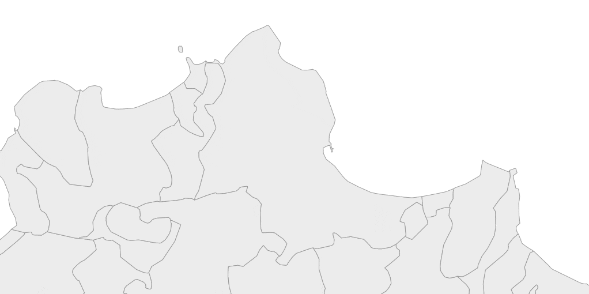

- [Cerco un centro di gravità permanente, per rappresentare il pendolarismo tra i Comuni italiani](#cerco-un-centro-di-gravità-permanente-per-rappresentare-il-pendolarismo-tra-i-comuni-italiani)
  - [Creare un punto di riferimento basato sull'&quot;edificato&quot;](#creare-un-punto-di-riferimento-basato-sullquotedificatoquot)
- [Risultati](#risultati)
- [Alternative](#alternative)
- [Dati utilizzati](#dati-utilizzati)
- [Software usato](#software-usato)

# Cerco un centro di gravità permanente, per rappresentare il pendolarismo tra i Comuni italiani

Ho il privilegio di frequentare lo stesso bar dietro al router di [**Günter Richter**](https://twitter.com/grichter). L'ultima volta, dopo esserci seduti, mi ha chiesto:

>Ciao Andrea, secondo te, c'è un .csv o geojson con tutti comuni, codice ISTAT ma le coordinate sull'edificato e non il baricentro del confine? Pensavo che forse Open Street Map lo ha, ma non lo trovo. Saluti Guenter; --- e viva le arancine e gli arancini !

Gli voglio bene, proprio perché riesce a tenere uniti il baricentro di un confine comunale e le arancine e gli arancini.

Il *focus* è proprio il **baricentro**, che come si vede sotto non è il centro di Bari 🤣🤣 (chi continua a leggere da qui in poi, lo fa proprio rischio). 
Il baricentro - o centroide - di una figura bidimensionale è la "posizione media" di tutti i suoi punti, ovvero la media aritmetica delle posizioni di ciascuno di essi (fonte [Wikipedia](https://www.wikiwand.com/it/Baricentro_(geometria))). Ad esempio il centroide del limite comunale di **1)** Bari cade fuori dal suo centro abitato; la cosa è ancora più evidente per **2)** Bitonto il cui centroide è lontano circa 10 km dal centro città.

L'obiettivo di Günter (che sta facendo qualcosa di bello con il caro [**Vincenzo Patruno**](https://twitter.com/vincpatruno)) è quello di trovare un modo per **rappresentare** i **dati aperti** sul [**pendolarismo** in Italia](https://www.istat.it/it/archivio/139381), a cura di ISTAT. È un file che contiene i dati sul numero di persone che si spostano tra comuni – o all’interno dello stesso comune – classificate per il motivo dello spostamento, il sesso, il mezzo di trasporto utilizzato, la fascia oraria di partenza e la durata del tragitto.

Una modalità classica è una mappa con delle **linee** che uniscono punti di **partenza** e **destinazione**, con uno stile che dia conto dei "percorsi" di pendolarismo più frequenti. 
Sotto ad esempio una mappa per la Sicilia occidentale, in cui il punto di maggior evidenza è il capologuo regionale (Palermo). **Da dove fare partire le linee**? Cosa usare per rappresentare come punto ciò che è un'area (parliamo infatti di dati sui Comuni)? 
Una possibilità è quella di usare i centroidi dei limiti comunali, che si possono generare con i software che gestiscono dati geografici. 
Però si rischia di avere una visualizzazione un po' falsata e/o errata. Nel caso di sotto due esempi forti:

1. uno di questi punti di partenza/destinazione è a mare (a Ovest). Rappresenta il centroide del Comune di Favignana, il cui territorio corrisponde all'arcipelago delle isole Egadi;
2. l'area costiera del Comune di Marsala, in cui si svolge gran parte della "vita" di quel territorio, sembra esclusa dal pendolarismo.

In entrambi i casi avviene perché il centroide è il frutto di un calcolo che dipende soltanto dalla forma del limite poligonale comunale. Non è "pesato" su dove vive la gente.

## Creare un punto di riferimento basato sull'"edificato"

Una risposta (anzi diverse risposte) a Günter sono nella sua domanda: per rappresentare meglio il pendolarismo ci si potrebbe **basare** su un punto di riferimento calcolato sull'**edificato** e non sul centroide dei limiti amministrativi.

Sono allora necessari i dati sulle caratteristiche di copertura e uso del territorio (in questo caso per tutto il territorio italiano), le cosidette "carte sull'**uso del suolo**". 
Come quelle basate sui dati aperti del progetto [**Corine Land Cover**](https://land.copernicus.eu/pan-european/corine-land-cover), attivo da quasi 30 anni, con aggiornamenti nel 2000, 2006, 2012, e 2018; in queste l'uso è distinto in 44 classi. 
Questi dati sono uno degli output del meraviglioso [**progetto Copernicus**](https://www.copernicus.eu/it), il programma di osservazione della Terra dell'Unione europea, dedicato a monitorare il nostro pianeta e il suo ambiente a beneficio di tutti i cittadini europei.

---

**NOTA BENE**: abbiamo lanciato un **concorso** per **articoli giornalistici** basati su **dati** del progetto **Copernicus** <https://ondata.it/j4c.html>

---

Qui sotto un esempio di mappa basata su dati Corine, in cui con i toni "rossastri" sono rappresentati i codici della classe "*Urban fabric*", che contiene al suo interno le sottoclassi "*Continuous urban fabric*" (con codice `111`) e "*Discontinuous urban fabric*" (codice `112`). 
Sono le aree in cui vive la maggior parte delle persone: utilizzare dei punti di riferimento basate su queste, per disegnare una mappa come quella di sopra, produrrebbe una rappresentazione migliore (il punto per il Comune di Favignana ad esempio non sarebbe a mare e alla zona costiera del Comune di Marsala verrebbe data la dovuta evidenza).

Quindi per generare questi punti a partire dal *layer* dei limiti comunali di ISTAT e da quello dell'uso del suolo del progetto Corine, si potrebbe procedere in questo modo:

- si "ritaglia" l'uso del suolo, basansosi sui limiti comunali;
- si associa ai poligoni dell'uso del suolo "ritagliato", il codice comunale corrispondente;
- si estraggono i poligoni con uso `111`;
- per ogni comune si prende il poligono `111` di area maggiore;
- per ogni comune, si crea un punto che ricade nel poligono `111` estratto.

In maniera semplificata, per un solo comune, è quanto visualizzato sotto:

È una procedura replicabile con molti strumenti GIS. Per questo tipo di processi trovo di gran comodità lo straordinario [**mapshaper**](https://github.com/mbloch/mapshaper), con cui ho creato [questo script](./centroidiComuni.sh) di esempio. 
Rispetto a quanto descritto sopra, nello script si tiene in considerazione anche dei poligoni con codice `112` ("*Discontinuous urban fabric*"), perché ci sono tantissimi comuni italiani in cui non è presente alcun area classificata come "*Continuous urban fabric*".

In output:

- i [punti](./output/comuni_11X.geojson) che rappresentano le aree "abitate", per quei comuni per i quali è stato possibile generarli in questa modalità (sono 6700);
- i [poligoni](./output/comuni_11X_poly.geojson) dei comuni associabili a questi punti;
- i [poligoni](./output/comuni_NO_11X.geojson) dei comuni non associabili a questi punti.

# Risultati

La procedura descritta, i dati utilizzati e lo *script* creato non risolvono pienamente il problema, perché non producuno un *output* per tutti i comuni di Italia. In ogni caso Günter dopo averli ricevuti mi ha scritto:

> Comunque i tuoi punti funzionano molto bene, ho comparato in alcune zone con geonames, è i tuoi vincono, mi sa perché sono oggettivi e satelliteari :)

In questo modo non è possibile associare un punto a ogni comune di Italia, per varie ragioni:

- i dati Corine che ho utilizzato hanno una *Minimum Mapping Unit* (MMU) di 25 ettari. In Italia ci sono comuni minuscoli (con meno di 100 abitanti);
- ci sono comuni (beati gli abitanti) per i quali non esitono aree classificate (sempre in relazione ai dati qui usati) come "*Urban fabric*".

Inoltre questa procedura, anche quando produce un risultato, può creare dei punti comunque problematici. 
Un caso è ad esempio legato alla stagionalità. Ci sono comuni di Italia, lontani dal mare, che hanno delle propaggini molto grandi sviluppate lungo costa, a cui corrisponde molto "cemento"; in questo caso l'area di "*Urban fabric*" più grande potrebbe non corrispondere all'edificato del comune, ma alla sua "espansione marina". Vale ad esempio per il comune di Agrigento e l'area di San Leone. 
Un altro è legato all'espansione de comuni stessi. Ci sono comuni le cui periferie si stanno estendendo all'interno dei limiti comunali di comuni limitrofi; tale espansione alcune volte ha un'area maggiore di quella abitata del comune "invaso". Vale ad esempio per il comune di Erice, all'interno del quale si sta espandendo quello di Trapani. 

# Alternative

Ci sono sicuramente dei dati già "pronti all'uso" per ottenere quanto descritto. A me vengono in mente:

- i [dataset di **geonames**](https://www.geonames.org/export/) da cui è possibile estrarre i comuni italiani;
- i dati **OpenStreetMap**, e in particolare i nodi taggati come `place=city`, `place=town` e `place=village`. [Qui](http://overpass-turbo.eu/s/OW8) ad esempio una query su overpass turbo, per vedere quelli di una certa area.

Anche questi però probabilmente, dopo un'analisi, non risolvono in modo pieno la cosa.

Si potrebbero utilizzare i dati delle sezioni di censimento ISTAT - da incrociare sempre con dati sull'uso del suolo - che in modo molto dettagliato consentono di mappare dove vivono le persone. 
O si potrebbe lavorare sui dati del dataset "[High Resolution Population Density Maps + Demographic Estimates](https://dataforgood.fb.com/docs/methodology-high-resolution-population-density-maps-demographic-estimates/)", che stima il numero di persone che vivono all'interno di un tassello di una griglia dal passo 30 metri in (quasi) tutti i paesi del mondo. 
O sull'integrazione di tutto questo.

Qui mi sono fermato a una soluzione non "perfetta", perché dopo averci ragionato un po' sopra con Günter, mi sembrava comunque interessante condivere processi e risultati.

---

# Dati utilizzati

Ne ho utilizzati due:

- lo shapefile CLC18, relativo ai dati Corine per l'Italia,  pubblicato qui <http://groupware.sinanet.isprambiente.it/uso-copertura-e-consumo-di-suolo/library/copertura-del-suolo/corine-land-cover/clc2018_shapefile/>;
- i limiti comunali a cura di ISTAT pubblicati qui <https://www.istat.it/storage/cartografia/confini_amministrativi/generalizzati/Limiti01012019_g.zip>.

# Software usato

- [**mapshaper**](https://github.com/mbloch/mapshaper), per creare gli output geografico/spaziali descritti;
- [**QGIS**](https://qgis.org), per produrre alcune delle immagini di questo articolo;
- [**Visual Studio Code**](https://code.visualstudio.com/), per scrivere questo articolo in `markdown` e gestire il *repository*;
