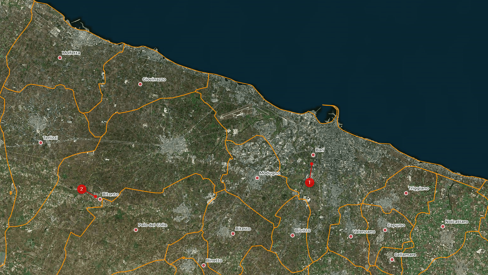
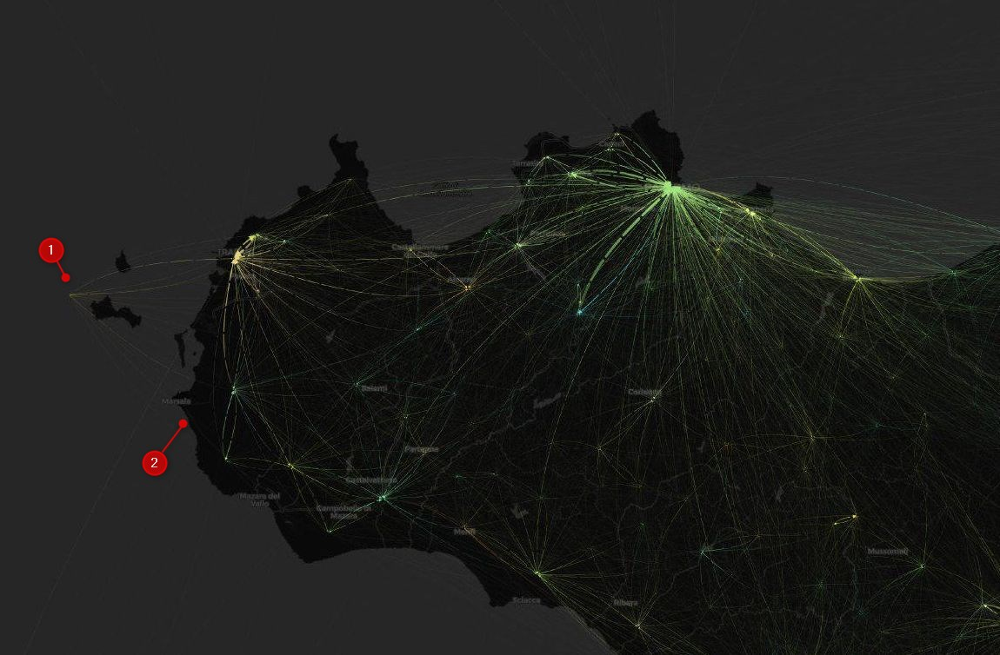
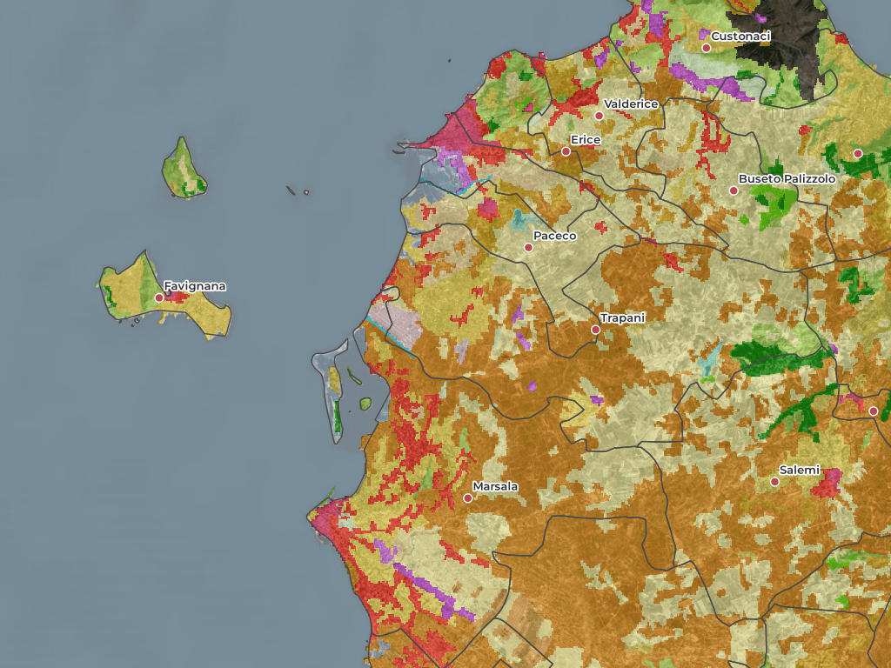

# Cerco un centro di gravità permanente, per rappresentare il pendolarismo tra i Comuni italiani

Ho il privilegio di frequentare lo stesso bar dietro al router di [**Günter Richter**](https://twitter.com/grichter). L'ultima volta, dopo esserci seduti, mi ha chiesto:

>Ciao Andrea, secondo te, c'è un .csv o geojson con tutti comuni, codice ISTAT ma le coordinate sull'edificato e non il baricentro del confine? Pensavo che forse Open Street Map lo ha, ma non lo trovo. Saluti Guenter; --- e viva le arancine e gli arancini !

Gli voglio bene, proprio perché riesce a tenere uniti il baricentro di un confine comunale e le arancine e gli arancini.

Il *focus* è proprio il **baricentro**, che come si vede sotto non è il Bari centro 🤣🤣 (chi continua a leggere da qui in poi, lo fa proprio rischio). 
Il baricentro - o centroide - di una figura bidimensionale è la "posizione media" di tutti i suoi punti, ovvero la media aritmetica delle posizioni di ciascuno di essi (fonte [Wikipedia](https://www.wikiwand.com/it/Baricentro_(geometria))). Il centroide del limite comunale di **1)** Bari cade fuori dal suo centro abitato; la cosa è ancora più evidente per **2)** Bitonto il cui centroide è lontano circa 10 km dal centro città.

L'obiettivo di Günter (che sta facendo qualcosa di bello con il caro [**Vincenzo Patruno**](https://twitter.com/vincpatruno)) è quello di trovare un modo per **rappresentare** i **dati aperti** sul [**pendolarismo** in Italia](https://www.istat.it/it/archivio/139381), a cura di ISTAT. È un file che contiene i dati sul numero di persone che si spostano tra comuni – o all’interno dello stesso comune – classificate, oltre che per il motivo dello spostamento, per il sesso, il mezzo di trasporto utilizzato, la fascia oraria di partenza e la durata del tragitto.

Una modalità classica è una mappa con delle **linee** che uniscono punti di **partenza** e **destinazione**, con uno stile che riesca ad esempio a dare conto dei "percorsi" di pendolarismo più frequenti. 
Sotto ad esempio una mappa per la Sicilia occidentale, in cui il punto di maggior evidenza è il capologuo regionale (Palermo). **Da dove fare partire le linee**? Cosa usare per rappresentare come punto ciò che è un'area (parliamo infatti di dati sui Comuni)? 
Una possibilità è quella di usare i centroidi dei limiti comunali, che si possono generare con i software che gestiscono dati geografici. 
Però si rischia di avere una visualizzazione un po' falsata e/o errata. Nel caso di sotto due esempi forti:

1. uno di questi punti di partenza/destinazione è a mare (a Ovest). Rappresenta il centroide del Comune di Favignana, il cui territorio corrisponde all'arcipelago delle isole Egadi;
2. l'area costiera del Comune di Marsala, in cui si svolge la "vita" di quel territorio, sembra esclusa dal pendolarismo.

In entrambi i casi avviene perché il centroide è il frutto di un calcolo che dipende soltanto dalla forma del limite poligonale comunale. Non è "pesato" su dove vive la gente.

## Calcolare un centroide basato sull'edificato

Una risposta (anzi diverse risposte) a Günter sono nella sua domanda: per rappresentare meglio il pendolarismo ci si potrebbe **basare** su un centroide calcolato sull'**edificato** e non sui limiti amministrativi.

Sono allora necessari i dati sulle caratteristiche di copertura e uso del territorio (in questo caso per tutto il territorio italiano), le cosidette "carte sull'**uso del suolo**". 
Come i dati aperti del progetto [**Corine Land Cover**](https://land.copernicus.eu/pan-european/corine-land-cover), attivo da quasi 30 anni, con aggiornamenti nel 2000, 2006, 2012, e 2018, in cui l'uso è distinto in 44 classi. 
È oggi uno degli output del meraviglioso [**progetto Copernicus**](https://www.copernicus.eu/it), il programma di osservazione della Terra dell'Unione europea, dedicato a monitorare il nostro pianeta e il suo ambiente a beneficio di tutti i cittadini europei.

---

**NOTA BENE**: abbiamo lanciato un **concorso** per **articoli giornalistici** basati su **dati** del progetto **Copernicus** <https://ondata.it/j4c.html>

---

Qui sotto un esempio di mappa basata su dati Corine, in cui con i toni "rossastri" sono rappresentati i codici della classe "*Urban fabric*", che contiene al suo interno le sottoclassi "*Continuous urban fabric*" (con codice `111`) e "*Discontinuous urban fabric*" (codice `112`). 
Sono le aree in cui vive la maggior parte delle persone: utilizzare i centroidi di queste, per disegnare una mappa come quella di sopra, produrrebbe una rappresentazione migliore (il punto per il Comune di Favignana ad esempio non sarebbe a mare e alla zona costiera del Comune di Marsala verrebbe data la dovuta evidenza).

# da fare

- aggiungere anche i poligoni con codice 112, perché altrimenti i comuni piccoli non escono fuori
- fare esempio di Morterone, ISTAT 097055, che con Corine è tutto verde
- fare esempio di Trapani che a EST è Erice, e non ha senso;
- mostrare soluzione http://overpass-turbo.eu/s/OW8

# Note

- altri modi, come quello di usare le sezioni ISTAT

http://www.istat.it/storage/cartografia/matrici_pendolarismo/matrici_pendolarismo_2011.zip

# fonte dati

- Corine Land Cover <http://groupware.sinanet.isprambiente.it/uso-copertura-e-consumo-di-suolo/library/copertura-del-suolo/corine-land-cover/clc2018_shapefile/>
- Limiti Comunali da <https://www.istat.it/storage/cartografia/confini_amministrativi/generalizzati/Limiti01012019_g.zip>
